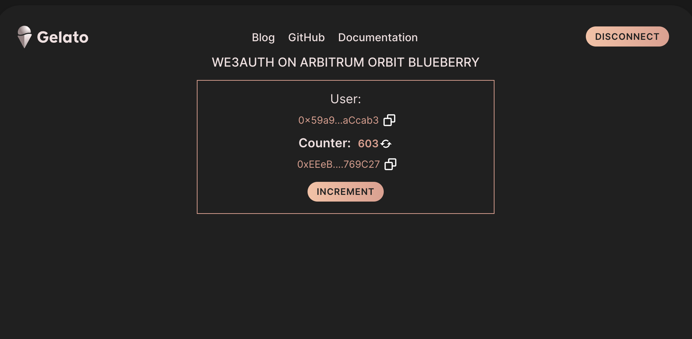
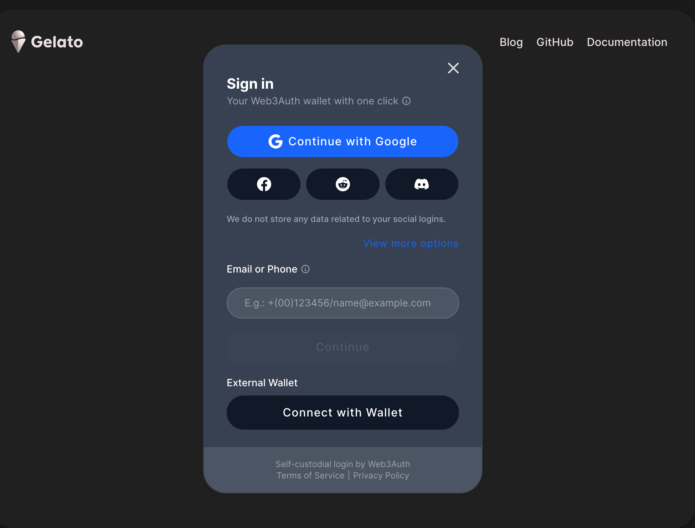
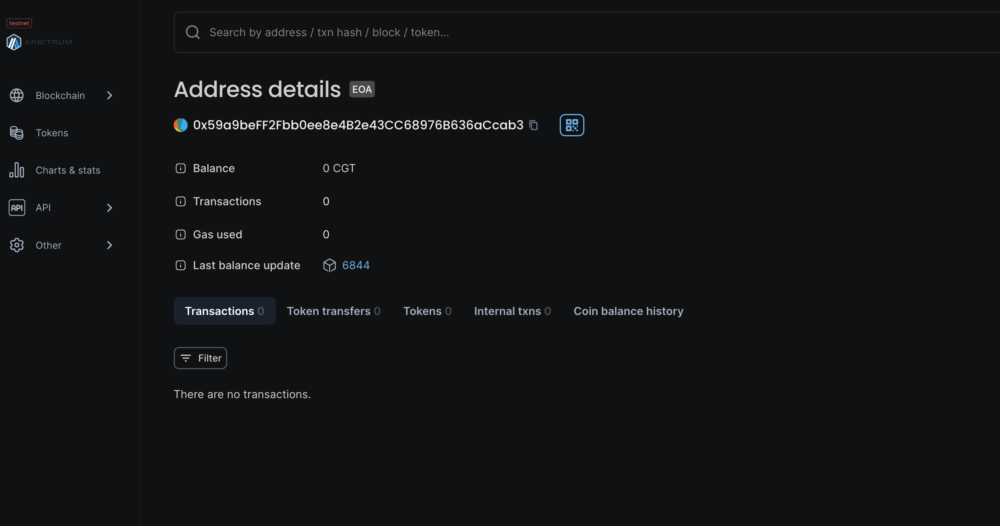
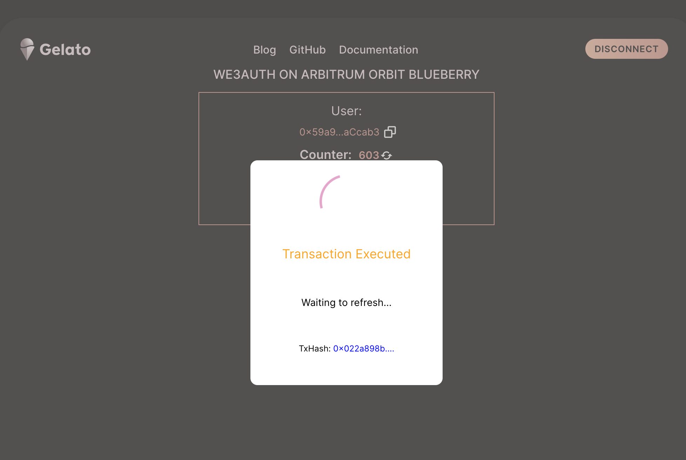

# How To #1 on Gelato: Web3Auth FE implementation

This project showcases a React implementation of web3Auth On Gelato Raas.

## Web3 App

[https://on-gelato-web3auth.web.app/](https://on-gelato-web3auth.web.app)

 

### Quick Start

Please add your sponsor key in here [here](/src/components/App/index.tsx#32) :

```
  const GELATO_RELAY_API_KEY = "YOUR GELATO SPONSOR KEY";
```

```
yarn start
```

### Code Snippets

**Web3Auth instantiation** for custom chains

```typescript
const web3auth = new Web3Auth({
  clientId:
    "BFolnrXUpJ8WScbI0MH.......", // get it from Web3Auth Dashboard
  web3AuthNetwork: "sapphire_devnet",
  chainConfig: {
    chainNamespace: "eip155", 
    chainId: "0xA4..",// Cahin Id in hex
    rpcTarget: "https://rpc.arb-blueberry.gelato.digital",
    displayName: "Blueberry",
    blockExplorer: "https://blockscout.op-testnet.gelato.digital",
    ticker: "ETH",
    tickerName: "ETH",
  },
});
await web3auth!.initModal();

const web3authProvider = await web3auth!.connect();

const provider = new ethers.providers.Web3Provider(web3authProvider!);
```
Login:

 

Explorer:

 


**Send Gasless Transaction**

Explorer:

 

```typescript
const { data: dataCounter } =
  await tmpCountercontract!.populateTransaction.increment();
const gasLimit = "10000000";
const chainId = (await provider!.getNetwork()).chainId;
   
      let web3AuthSigner  = signer;
   
      const relay = new GelatoRelay();
      const request: CallWithERC2771Request = {
        chainId,
        target: targetAddress,
        data: dataCounter as string,
        user: signerAddress as string,
      };
  
      const response = await relay.sponsoredCallERC2771(
        request,
        signer,
        GELATO_RELAY_API_KEY as string
      );
      console.log(`https://relay.gelato.digital/tasks/status/${response.taskId}`);
     
```
